## Shaping Curves with Parametric Equations


This post explores a technique to render volumetric curves on the GPU — ideal for shapes like ribbons, tubes and rope. The curves are defined by a parametric equation in the vertex shader, allowing us to animate hundreds and even thosuands of curves with minimal overhead.

Parametric curves aren't a novel idea in WebGL; ThreeJS already supports something called ExtrudeGeometry. You can read about some of its implementation details [here](). This class can be used to extrude a 3D curve or path into a volumetric line, like a 3D tube. However, since the code runs on the CPU and generates a new geometry, it isn't well suited for animating the curve every frame, let alone several hundred curves.

Instead, let's what we can accomplish with just a vertex shader. The technique presented here has various downsides and isn't very robust, but it can look great in certain cases and tends to be fast to compute. You can see the final result of this blog post here:

<iframe src="https://parametric-curves.surge.sh/" style="border: 0;" scrolling="no" width="100%" height="400px"></iframe>

I used this technique for the swirling 3D lines in my [Christmas Experiment](christmasexperiments.com/2016/19/sugar/) this year. The experiment also used parametric equations for the bouncing surface, so the concepts presented in this post can carry over to other areas.

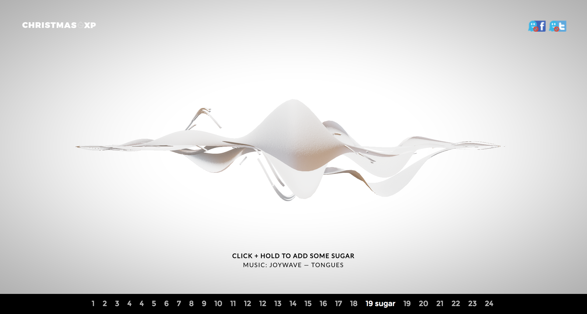

I'm also using volumetric lines for a "neon tube" effect in an upcoming demo; you can see some screenshots here:

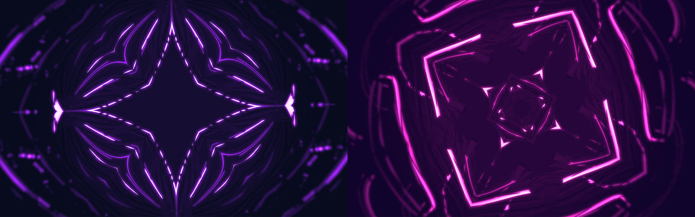

## Building the Tube Geometry

For this to work, we're going to re-purpose a `THREE.CylinderGeometry` so that our UVs, end caps and faces all line up like a regular cylinder geometry. If it goes to plan, we should be able to render a simple cylinder with our volumetric curve code.

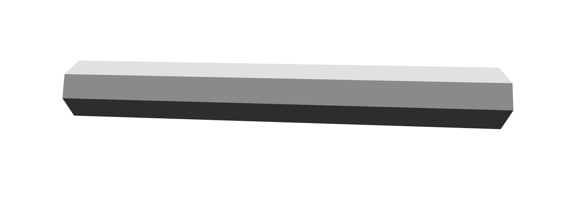

However, our geometry won't work with the built-in ThreeJS shaders because it's composed of the following custom vertex attributes:

- `position` a *one dimensional* float along the X axis in the range -0.5 to 0.5, telling us the distance of the vertex along the curve
- `angle` a float in radians in the range -π to π, telling us how far *around* the tube this vertex is

When building the geometry, we also have to decide how much to subdivide our curve (i.e. length segments) and how many sides our tube should have (i.e. radial segments).

Some pseudocode:

```js
// will be used as vertex attributes
const angles = [];
const positions = [];

// get vertex attributes
for each face in baseGeometry:
  for each vertex in face:
    // normalize the 2D position
    temp.set(vertex.y, vertex.z).normalize();

    // find the radial angle around the tube
    const angle = Math.atan2(temp.y, temp.x);
    angles.push(angle);

    // copy the X position
    positions.push(vertex.x);
```

You can see the final `createTubeGeometry` function [here](). The full function also copies the `uv` attribute so that we can texture the tube if desired (e.g. adding normal mapping). We can refine the geometry later with the `subdivisions` and `numSides` parameters.

With this utility function, we can create a new ThreeJS geometry:

```js
const createTubeGeometry = require('../util/createTubeGeometry');

// tweak these to your liking
const numSides = 8;
const subdivisions = 50;

// create the ThreeJS Geometry
const geometry = createTubeGeometry(numSides, subdivisions);
```

## Setting up the Shader

The next step is to create a material that encapsulates our snazzy vertex shader. We'll be using [glslify]() here to pre-process our shaders and make our lives a bit easier.

```js
const glslify = require('glslify');

const material = new THREE.RawShaderMaterial({
  vertexShader: glslify(path.resolve(__dirname, '../shaders/tube.vert')),
  fragmentShader: glslify(path.resolve(__dirname, '../shaders/tube.frag')),
  side: THREE.FrontSide,
  extensions: {
    deriviatives: true
  },
  defines: {
    lengthSegments: subdivisions.toFixed(1),
    FLAT_SHADED: false
  },
  uniforms: {
    thickness: { type: 'f', value: 1 },
    time: { type: 'f', value: 0 },
    radialSegments: { type: 'f', value: numSides }
  }
});
```

Notice the `extensions` and `defines` fields; these will later be used for flat normals. `FLAT_SHADED` should be false if you plan to have a smooth tube-like geometry, or set to true if you are looking for something like a triangular prism or twisted rectangle.

The shader will also need to know the `subdivisions` we used in `createTubeGeometry`, which is passed as a `#define` constant so we can use it in loop expressions.

Before we move onto the GLSL, we already have all the features we need to construct a 3D object. We can add it to our scene like so:

```js
const mesh = new THREE.Mesh(geometry, material);
mesh.frustumCulled = false;
scene.add(mesh);
```

The only gotcha is that we should disable frustum culling, since our geometry only contains a 1-dimensional `position` attribute which causes issues with ThreeJS's built-in frustum culling.

## The Vertex Shader

There are two key functions: the parametric function, and solving the Frenet-Serret frame.

You can follow along with the complete shader here:  
[shader]()

#### The Parametric Function

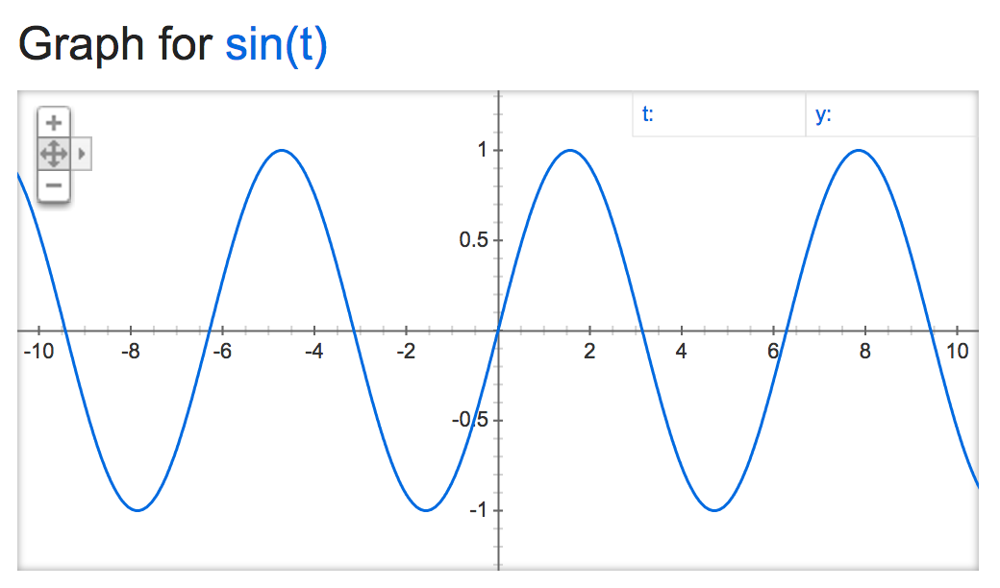

> :bulb: **Tip:** You can enter parametric equations into Google to see how they look!

The parametric function is the most important one, as it allows us to manipulate the design and shape of our curves. Later, we'll explore how we can create some more interesting functions, but for now we want to just build a tube that undulates along the Y axis like a wave.

The input to this function will be *t*, the arc length of the curve normalized to `[0.0 .. 1.0]` range, where `0.0` is the start point of the curve and `1.0` is the end point. However, many equations will also work with inputs below zero and above one, which might be useful if you're altering the *t* parameter before computing the curve.

The function will return the 3D position of the curve at *t* distance along it, in world units.

For the *x* axis, we can use `t * 2.0 - 1.0` to get a value from -1.0 (start cap) to 1.0 (end cap). For the *y* axis, we will use `sin(t + time)` which will make the tube appear to glide slowly up and down.

```glsl
vec3 sample (float t) {
  float x = t * 2.0 - 1.0;
  float y = sin(t + time);
  return vec3(x, y, 0.0);
}
```

Using this as our parametric equation will give us the following animated curve:

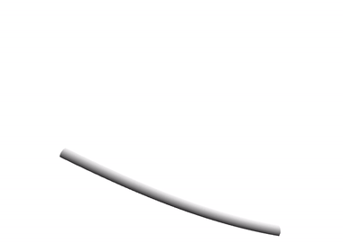

#### Solving the Frenet-Serret Frame

Once we have a `sample(t)` function, we can use it to construct the normals and position for the tube geometry at each vertex.

By sampling the current and next point in the curve, we can find the **T**angent, **N**ormal and **B**inormal, also called the [Frenet-Serret Frame or TNB Frame](https://en.wikipedia.org/wiki/Frenet%E2%80%93Serret_formulas).

With the computed frame, we can extrude away from the center line of the curve using the `angle` attribute we stored earlier. We multiply the extrusion by `volume`, a 2D vector which acts as the radius (or thickness) of our tube. Since it's 2D, we could "pinch" the tube to look more like a flat or oval shape.

```glsl
void createTube (float t, vec2 volume, out vec3 offset, out vec3 normal) {
  // find next sample along curve
  float nextT = t + (1.0 / lengthSegments);

  // sample the curve in two places
  vec3 current = sample(t);
  vec3 next = sample(nextT);
  
  // compute the Frenet-Serret frame
  vec3 T = normalize(next - current);
  vec3 B = normalize(cross(T, next + current));
  vec3 N = -normalize(cross(B, T));

  // extrude outward to create a tube
  float tubeAngle = angle;
  float circX = cos(tubeAngle);
  float circY = sin(tubeAngle);

  // compute position and normal
  normal.xyz = normalize(B * circX + N * circY);
  offset.xyz = current + B * volume.x * circX + N * volume.y * circY;
}
```

## The Fragment Shader

The fragment shader is fairly basic: it decides whether to use the smooth normal we computed above, or whether to approximate a flat normal using `glsl-face-normal`.

The "shading" is just rendering the Y-normal in a 0 to 1 range to give the tube some depth.

```glsl
#extension GL_OES_standard_derivatives : enable
precision highp float;

varying vec3 vNormal;
varying vec2 vUv;
varying vec3 vViewPosition;

#pragma glslify: faceNormal = require('glsl-face-normal');

void main () {
  vec3 normal = vNormal;
  #ifdef FLAT_SHADED
    normal = faceNormal(vViewPosition);
  #endif

  float diffuse = normal.y * 0.5 + 0.5;
  gl_FragColor = vec4(vec3(diffuse), 1.0);
}
```

With all that in place, we get a shaded tube that can fly around in 3D space.


## Designing with Math

Ok! Let's kick it up a notch by changing `sample(t)`, our parametric equation.

We can start with a circle, where *t* is an angle from 0 to 2π.

```glsl
vec3 sample (float t) {
  float angle = t * 2.0 * PI;
  vec2 rot = vec2(cos(angle), sin(angle));
  return vec3(rot, 0.0);
}
```

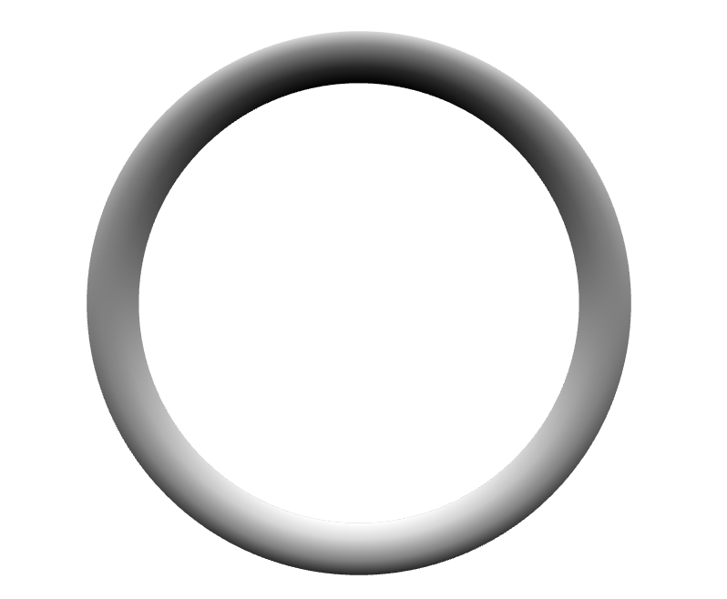

---

If we give some depth to the *z* parameter, we can create a corkscrew.

```glsl
vec3 sample (float t) {
  float angle = t * 2.0 * PI;
  vec2 rot = vec2(cos(angle), sin(angle));
  float z = t * 2.0 - 1.0;
  return vec3(rot, z);
}
```

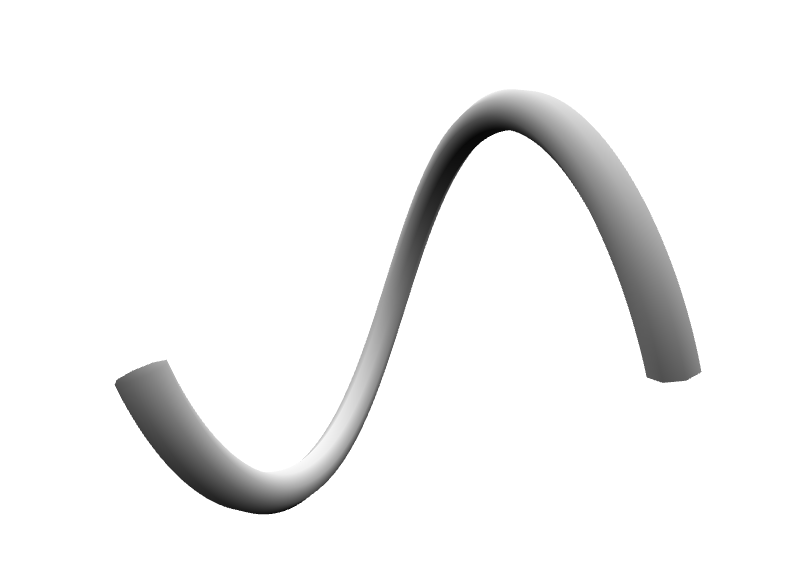

> :bulb: Try multiplying `angle` by a whole number to add more twists!

---

We can also use a 3D spherical coordinates as a base, instead of a 2D circle.

```glsl
vec3 spherical (float r, float phi, float theta) {
  return vec3(
    r * cos(phi) * cos(theta),
    r * cos(phi) * sin(theta),
    r * sin(phi)
  );
}

vec3 sample (float t) {
  float angle = t * 2.0 * PI;

  float radius = 1.0;
  float phi = t * 2.0 * PI;
  float theta = (t * 2.0 - 1.0);

  return spherical(radius, time + phi, theta);
}
```

The `r` (radius), `phi` and `theta` parameters can be a function of `t` to create some interesting shapes like [torus knots](http://paulbourke.net/geometry/knots/).

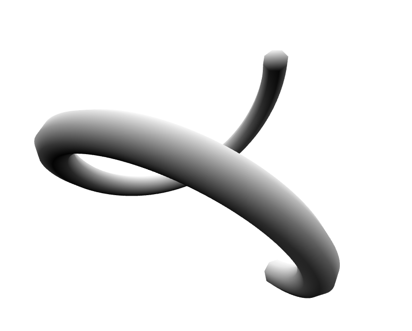

---

After some trial and error, we end up with a torus knot like this:

```glsl
vec3 sample (float t) {
  float beta = t * PI;
  
  float r = sin(beta * 2.0) * 0.75;
  float phi = sin(beta * 8.0 + time);
  float theta = 4.0 * beta;

  return spherical(r, phi, theta);
}
```

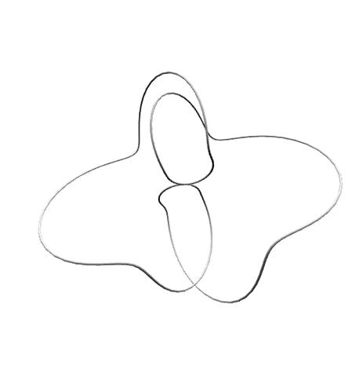

## Multiple Instances

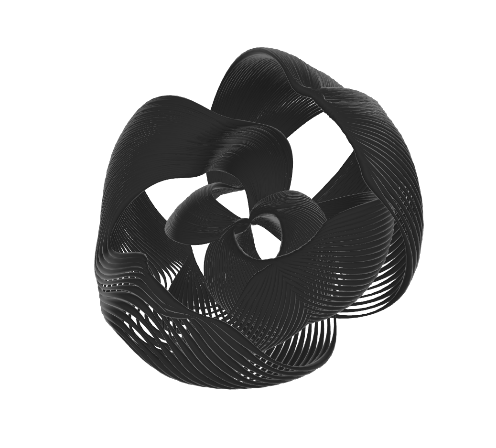

Things really start to take shape once you add in more curve meshes. For performance, they should all share the same geometry we created earlier.

To achieve the screenshot above, our final parametric function looks similar but with some angles offset by an `index` uniform — a float from 0.0 to 1.0 which is the result of `meshIndex / (totalMeshes - 1)`. The image above uses 40 curves with 300 subdivisions and a random thickness per curve.

```glsl
#pragma glslify: ease = require('glsl-easings/exponential-in-out');

vec3 sample (float t) {
  float beta = t * PI;
  
  float ripple = ease(sin(t * 2.0 * PI + time)) * 0.25;
  float noise = time + index * ripple * 8.0;
  
  float r = sin(index * 0.75 + beta * 2.0) * 0.75;
  float theta = 4.0 * beta + index * 0.25;
  float phi = sin(index * 2.0 + beta * 8.0 + noise);

  return spherical(r, phi, theta);
}
```

We're also modulating the per-vertex `volume` before solving the Frenet-Serret frame. This gives each curve some variety in its thickness.

```glsl
  // build our tube geometry
  vec2 volume = vec2(thickness);

  // animate the curve thickness
  float volumeAngle = t * lengthSegments * 0.5 + index * 20.0 + time * 2.5;
  float volumeMod = sin(volumeAngle) * 0.5 + 0.5;
  volume += 0.01 * volumeMod;

  ... createTube(...);
```

And, lastly, we add some fake rim lighting in the fragment step and mix it with the Z-normal of the tube:

```glsl
  ...
  vec3 V = normalize(vViewPosition);
  float vDotN = 1.0 - max(dot(V, normal), 0.0);
  float rim = smoothstep(0.5, 1.0, vDotN);

  float diffuse = normal.z * 0.5 + 0.5;
  diffuse += rim * 2.0;
  ...
```

## Gotchas

#### Twists & Vanishing Curves

As I mentioned in the intro, this technique has some serious downsides. One is that, depending on your equation, the Frenet-Serret frame might lead to chaotic twists in rotation. Below is a particularly bad edge case that shows a lot of twists:

```glsl
vec3 sample (float t) {
  return vec3(t * 2.0 - 1.0, t * 2.0 - 1.0, 0.0);
}
```

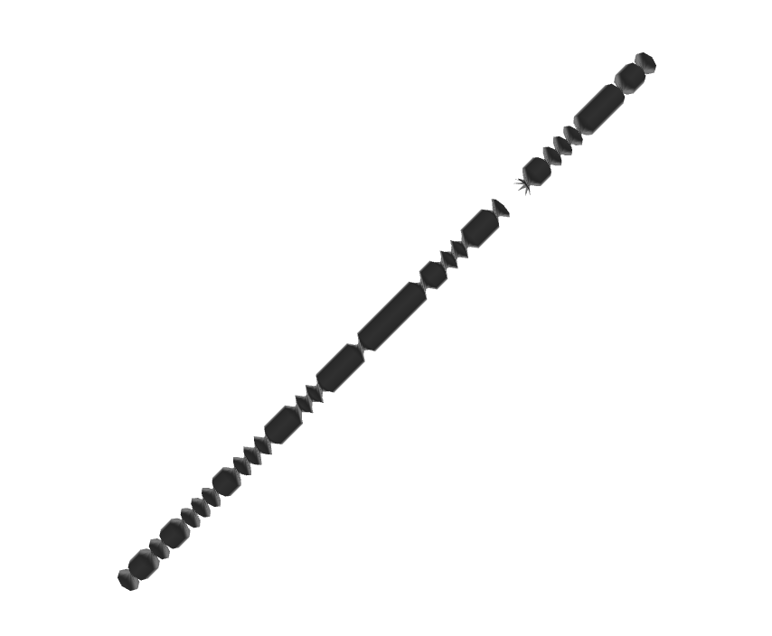

To solve this, we need to use Parallel Transport frames. For each vertex, we need to solve all the Frenet-Serret frames that have come before it. This is extremely expensive, and depending on your subdivision and number of sides, you might only be able to render a handful of curves before you reach a vertex shader bottleneck.

The final vertex shader provides a `ROBUST` define flag that solves this issue, at the expense of performance:

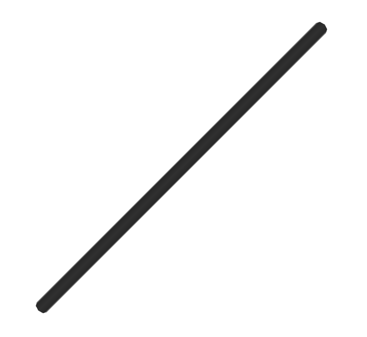

A similar problem arises with exactly straight lines, in which will disappear entirely using our fast Frenet-Serret approach.

```glsl
vec3 sample (float t) {
  return vec3(t * 2.0 - 1.0, 0.0, 0.0);
}
```

Again, you can enable the `ROBUST` define at the cost of performance, or jitter your components slightly so the line is no longer exactly straight.

#### End Cap Normals

Another unsolved problem in this demo is the normals of the end caps. They look a little puffy when using smooth normals, but ideally they should appear flat. I'd be curious to hear if others have an idea of how to solve this.

#### Closed Curves

This demo does not attempt to render closed curves — it just so happens that, with the fast Frenet-Serret approach, the curve seems to close naturally. The same parametric equations with the `ROBUST` flag will *not* close properly, as Parallel Transport requires an additional (expensive) pass over the segments to close the curve properly.

## Taking it Further

There are lots of interesting things we can do from here, like:

- use a [custom MeshStandardMaterial](https://gist.github.com/mattdesl/034c5daf2cf5a01c458bc9584cbe6744) for shading and reflections
- using HDR bloom for a "neon tube" effect
- modulating the *t* parameter before sending it to the parametric equation, e.g. to make it appear like each curve is being drawn in.
- use instanced buffer geometry to reduce the number of draw calls
- use noise and texture reads in our parametric equation for a variety of effects

